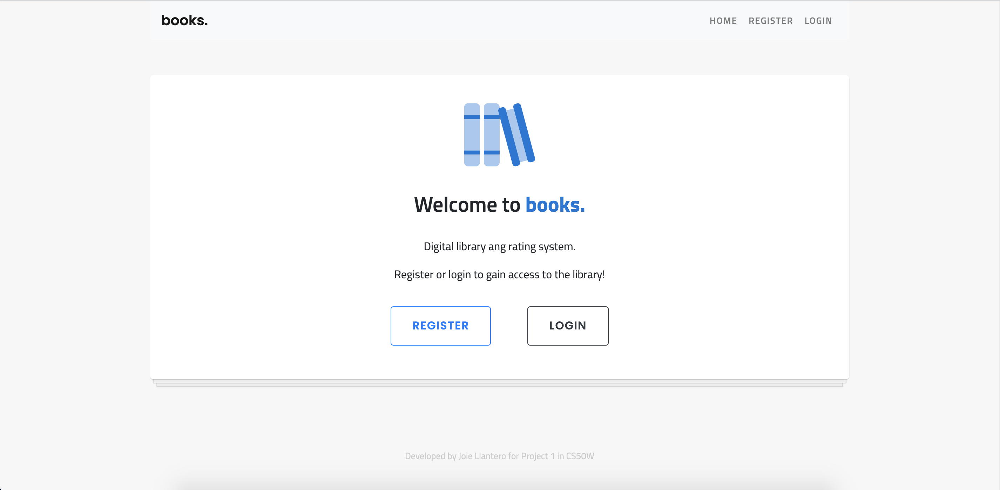
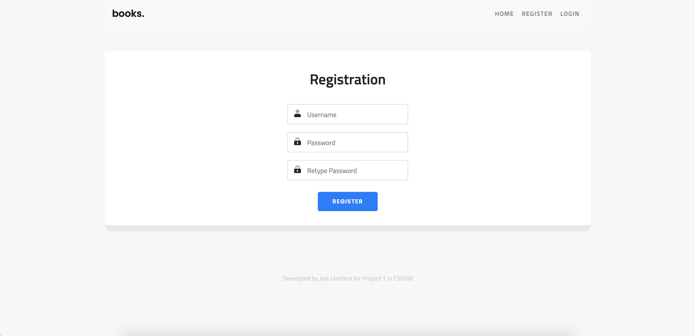
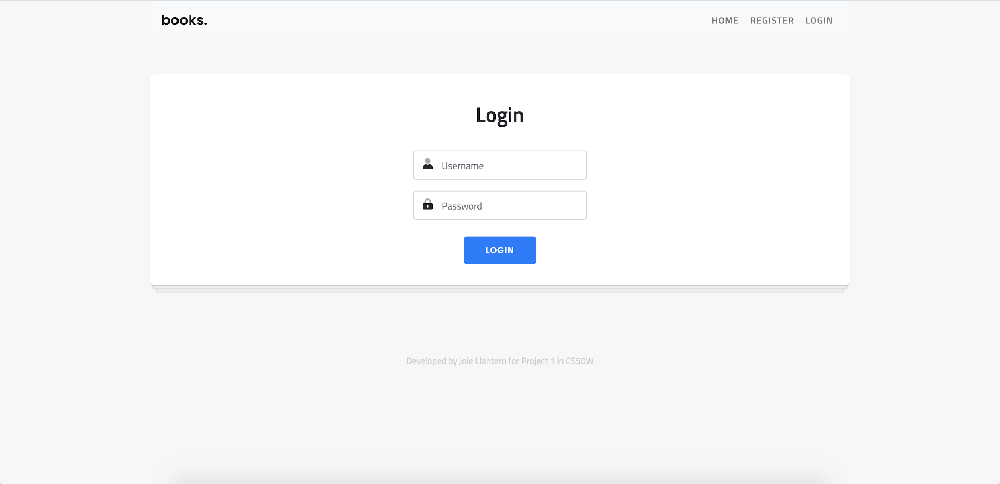

</a>

# books.

> A website demonstrating SQL queries using python and flask; also, demonstrates HTTP status codes, API access, and API calls. A project in CS50W

## Usage

- Register or Login

</a>

</a>

- Use library page to search books by ISBN, title or author


- View user ratings or create own rating


- API access via GET request


## Local Deployment

- All the `code` required to get started

### Clone

- Clone this repo to your local machine using `https://github.com/joiellantero/books.git`

### Setup

- After cloning, run the following code to get started:

> Open terminal and navigate to the directory of the cloned repo

```shell
$ cd books-<branchname>

# example - if on branch master
$ cd books-master
```

> Install the required modules

```shell
$ pip3 install -r requirements.txt
```

> Setup flask and database

```shell
$ export FLASK_APP=application.py
$ export DATABASE_KEY=<URI>
$ export GOODREADS_KEY=<key>
```

- Obtain URI and key from author

### Run

> Run flask

```shell
$ flask run
```

### Resources

- Images from Freepik.com
- Bootstrap v4.4.1
- Font Awesome Pro 5.13.0
